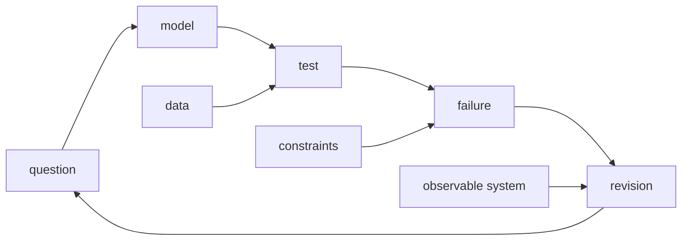
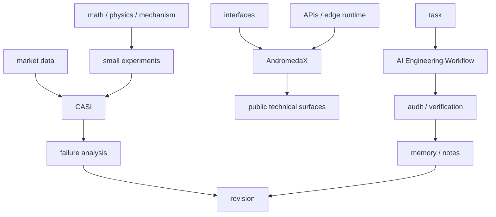
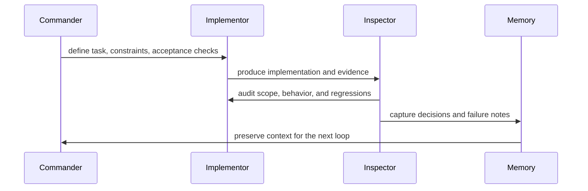

<div align="center">

# Jeremy Li

**AI/ML systems&nbsp; ·&nbsp; quantitative research&nbsp; ·&nbsp; web infrastructure**

<p>I build systems that connect theory, data, and deployable software.</p>

 model -> test -> failure -> revision" />

<p>
  <a href="mailto:jeremyli.ava@gmail.com"></a>
  <a href="https://github.com/JeremyLih"></a>
  <a href="https://andromedax.org"></a>
  
</p>

<p>
  
  
  
  
  
  
</p>

<sub>
  <a href="#working-loop">Working Loop</a> ·
  <a href="#active-systems">Active Systems</a> ·
  <a href="#how-i-think-across-layers">How I Think</a> ·
  <a href="#research--build-philosophy">Philosophy</a> ·
  <a href="#tech-stack">Tech Stack</a> ·
  <a href="#current-focus--learning">Focus</a> ·
  <a href="#github-in-numbers">Stats</a> ·
  <a href="#contact">Contact</a>
</sub>

</div>

---

> [!NOTE]
> I build systems that make reasoning, uncertainty, and failure visible.

```txt
lab console
-----------
mode      : research-builder
loop      : question -> model -> test -> failure -> revision
systems   : CASI | AndromedaX | AI Engineering Workflow
constraint: inspectability before scale
```

---

## Working Loop

```txt
question -> model -> test -> failure -> revision
```

I try to build in small, inspectable loops. The goal is not to make a system look impressive at the beginning, but to expose where it fails, understand why, and improve the parts that survive testing.



---

## Active Systems

<sub>Status labels describe current direction and working mode, not finished-product claims.[^status]</sub>

| System | What it is | Pipeline | Status |
| :--- | :--- | :--- | :--- |
| **CASI** | AI-driven quantitative research system testing weak ML signals under realistic constraints | `market data -> features -> signal -> decision -> pnl` |  |
| **AndromedaX** | Web and infrastructure surface for shipping technical projects with clean interfaces and APIs | `interface -> api -> edge runtime -> deploy` |  |
| **AI Engineering Workflow** | Commander / Implementor / Inspector workflow for AI-assisted software work | `task -> command -> implementation -> audit -> memory` |  |



### CASI

```txt
market data -> features -> signal -> decision -> pnl
```

CASI is an AI-driven quantitative research system focused on testing whether weak machine-learning signals can survive transaction costs, regime shifts, and execution constraints.

<details>

<summary><strong>CASI research notes</strong></summary>

<br>

CASI is not just a model. It is a full research pipeline for asking whether a trading signal remains useful after realistic constraints are added.

| Focus | Questions |
| :--- | :--- |
| Signal validity | Can a weak signal remain positive after fees and slippage? |
| Regimes | Does the signal survive different market regimes? |
| Execution assumptions | Are the backtest, paper-trading logic, and execution assumptions consistent? |
| Reproducibility | Can the system be replayed, inspected, and debugged later? |

Current focus:

- Deterministic market data pipeline
- Feature generation and validation
- Signal calibration
- Regime-aware decision logic
- Paper-trading and PnL reconstruction
- Failure analysis before scaling complexity

</details>

### AndromedaX

```txt
interface -> api -> edge runtime -> deploy
```

AndromedaX is my web and infrastructure direction for shipping technical projects with cleaner interfaces, APIs, and deployment surfaces &nbsp;·&nbsp; [andromedax.org](https://andromedax.org)

<details>

<summary><strong>AndromedaX build notes</strong></summary>

<br>

| Use | Current focus |
| :--- | :--- |
| Build small public-facing technical projects | Project landing pages |
| Test UI ideas for AI tools and data systems | AI-assisted tools |
| Connect frontend interfaces with backend APIs | Cleaner routing, authentication, and API structure |
| Deploy through modern web infrastructure | Cloudflare-based deployment |
| Make experimental systems easier to access | Clearer project surfaces and documentation |

</details>

### AI Engineering Workflow

```txt
task -> command -> implementation -> audit -> memory
```

AI Engineering Workflow is a Commander / Implementor / Inspector workflow for using AI agents to build software while preserving scope, state, and verification.

<details>

<summary><strong>AI engineering workflow notes</strong></summary>

<br>

| Use | Current focus |
| :--- | :--- |
| Keep AI-assisted engineering scoped and inspectable | Clear task boundaries |
| Separate planning, implementation, and review | Reviewable implementation steps |
| Preserve project state across longer build sessions | Failure notes and memory capture |
| Make verification part of the workflow | Better handoff between ideas, code, tests, and revision |



</details>

---

## How I Think Across Layers

My work sits between machine learning, math, physics, trading systems, and full-stack infrastructure. At every layer I keep asking the same thing: what is the system *actually* doing, and how does it fail?

| Layer | Question I keep asking | What can go wrong |
| :--- | :--- | :--- |
| **Math / Physics** | What mechanism explains the behavior? | Elegant theory, weak contact with reality |
| **ML / DL** | Does the model generalize outside the setup? | Leakage, overfitting, noisy metrics |
| **Quantitative systems** | Does the signal survive cost and regime shifts? | Paper alpha that disappears in execution |
| **Web infrastructure** | Can this be run, inspected, and changed later? | Prototype code hardening into permanent debt |
| **Interface / UI** | Does the interface reveal the system's real state? | Visual polish hiding real uncertainty |

---

## Research & Build Philosophy

I am most interested in systems where correctness is not obvious from the first result.

| Surface result | Failure mode |
| :--- | :--- |
| A model can look good | Leakage |
| A backtest can look good | Costs are ignored |
| A web app can look good | Broken state is hidden |
| A theory can look elegant | Weak contact with reality |

One way I think about these systems:

```math
\text{usable edge} \approx \text{signal} - \text{cost} - \text{uncertainty} - \text{implementation error}
```

So I try to build around a few principles:

- Reasoning before implementation
- Small experiments before large systems
- Validation before optimization
- Readable code before clever code
- Reproducibility before speed
- Interfaces that show state, uncertainty, and trade-offs

A good technical project should make it possible to ask:

> What exactly is the system doing? &nbsp;·&nbsp; What assumptions does it depend on? &nbsp;·&nbsp; What breaks when the environment changes? &nbsp;·&nbsp; Can the result be reproduced? &nbsp;·&nbsp; Can another person understand and improve it later?

---

## Tech Stack

<div align="center">
  
</div>

| Purpose | Tools |
| :--- | :--- |
| **Research / Modeling** | Python, PyTorch, NumPy, Pandas, scikit-learn |
| **Experimentation** | Jupyter, pytest, Parquet, matplotlib |
| **Systems / Infrastructure** | Git, GitHub, bash, TypeScript |
| **Deployment** | Cloudflare, Workers, Pages, KV / D1 |

Workflow:

```txt
experiments -> logs -> validation -> failure notes -> revision
```

I prefer tools that make a system easier to inspect, reproduce, and repair.

---

## Current Focus & Learning

**Right now I am:**

- Making CASI more deterministic, replayable, and honest about failure
- Turning AndromedaX into a cleaner home for technical projects
- Improving my ability to connect math, ML, and software into usable systems
- Building projects that can become long-term research and portfolio assets

**And actively learning:**

| Area | Direction |
| :--- | :--- |
| **Machine learning and deep learning** | Models, evaluation, and generalization |
| **Quantitative systems** | Signals, regimes, risk, and PnL |
| **Probability, statistics, and optimization** | Better reasoning under uncertainty |
| **Physics and mathematical modeling** | Mechanisms, abstraction, and explanation |
| **Full-stack web infrastructure** | Interfaces, APIs, deployment, and operations |
| **AI-assisted engineering workflows** | Scope control, verification, and memory |

---

## GitHub in Numbers

<div align="center">
  
  
</div>

---

## Contact

| Contact | Link |
| :--- | :--- |
| Email | [jeremyli.ava@gmail.com](mailto:jeremyli.ava@gmail.com) |
| GitHub | [JeremyLih](https://github.com/JeremyLih) |
| Website | [andromedax.org](https://andromedax.org) |

<div align="center">
  <sub>Built in small, inspectable loops &nbsp;·&nbsp; question → model → test → failure → revision</sub>
</div>

[^status]: Status labels describe current direction and working mode, not finished-product claims.
