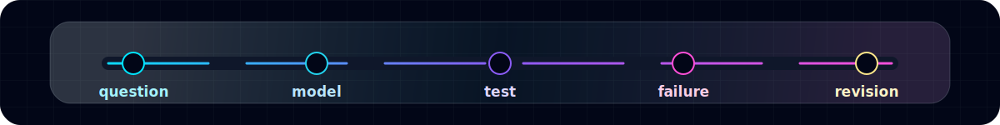

<div align="center">



<p>
  <a href="mailto:jeremyli.ava@gmail.com"><b>Email</b></a>
  ·
  <a href="https://github.com/JeremyLih"><b>GitHub</b></a>
</p>

<p>
  <code>AI/ML</code> · <code>quant systems</code> · <code>math + physics</code> · <code>web infrastructure</code>
</p>

</div>

---

### `CURRENT_LOOP`



---

<table width="100%">
  <tr>
    <td width="58%" valign="top">

<h3><code>WORKING_NOTES</code></h3>

<p>I am learning and building around machine learning, quantitative systems, math, physics, and practical web infrastructure.</p>

<p>The current direction is simple: take ideas from theory, test them against data or working software, then keep the parts that survive real constraints.</p>

<pre>question -> model -> test -> failure -> revision</pre>

<p><b>What I care about</b></p>

<ul>
  <li>Clear reasoning before complicated implementation</li>
  <li>Small experiments that expose whether an idea is real</li>
  <li>Readable systems that can be debugged later</li>
  <li>Interfaces that make state, uncertainty, and trade-offs visible</li>
</ul>

    </td>
    <td width="42%" valign="top">

<h3><code>BUILD_QUEUE</code></h3>

<p><b>CASI</b><br />AI-driven trading research system.</p>

<pre>market data -> features -> signal -> decision -> pnl</pre>

<p><b>AndromedaX</b><br />A web/infrastructure direction for shipping technical projects with cleaner deployment and UI surfaces.</p>

<pre>interface -> api -> edge runtime -> deploy</pre>

<p><i>Mostly experiments, notes, and systems under construction.</i></p>

    </td>
  </tr>
</table>

---

### `THINKING_MODEL`

| Layer | Question I keep asking | What can go wrong |
| :--- | :--- | :--- |
| **Math / Physics** | What mechanism explains the behavior? | Nice theory, weak contact with reality |
| **ML / DL** | Does the model generalize outside the setup? | Leakage, overfitting, noisy metrics |
| **Quant Systems** | Does the signal survive cost and regime shifts? | Paper alpha that disappears in execution |
| **Infrastructure** | Can this be run, inspected, and changed later? | Prototype code turning into permanent debt |
| **UI** | Does the interface reveal the system state clearly? | Visual polish hiding important uncertainty |

---

### `TOOLS_IN_ROTATION`

```txt
Python      PyTorch      NumPy        Pandas      scikit-learn
Jupyter     Git          GitHub       TypeScript  Cloudflare
```

---

<div align="center">


</div>
